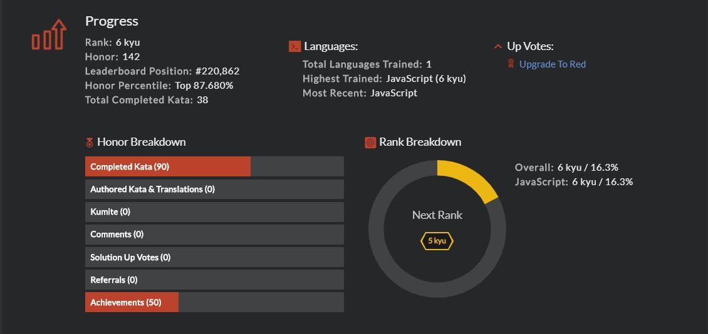
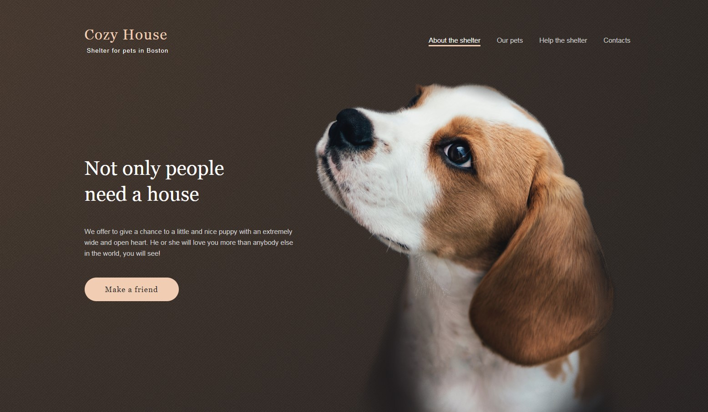
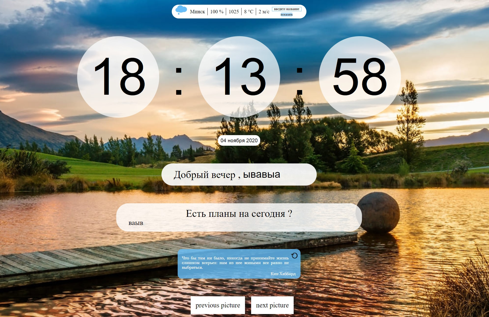

# Curriculum Vitae

## Ilya Safyan  | 22 y.o. |	

  

## Contact

**Address: Belarus, Minsk**

**Email: js.learn.safyan@gmail.com **

**Telegram: *@ibot_minsk***

**Instagram: *@isafyan***

**GitHub: *@roadToTheFuture***

## Resume

While studying at the university, I took part in the competition for the best layout of the site. This topic interested me and, since the university program seemed to me insufficient, I decided to deepen my knowledge on this issue. As a result, my project took first place. I was so carried away by the process of website development that I decided to continue self-study. Now I realized that i can not only work, but do what i love. Every day I improve my knowledge in the field of frontend development. My goal is to become a full **Full stack** developer and develop the coolest projects that make our world better.

## Hard-skills

- [x] HTML/CSS/SCSS      
- [x] Flexbox, Bootstrap, Grid
- [x] JavaScript ES6
- [x] Gulp
- [x] GIT 

## Code Example

I've written can be seen at my github account: [@roadToTheFuture](https://github.com/roadToTheFuture/Basic-Js-Exercices)

###  Codewars: 

- | Nick: ibot                                   |
  | -------------------------------------------- |
  | Account: https://www.codewars.com/users/ibot |
  |                 |

## Experience

- | Simple Pixel Perfect layout                                  |
  | ------------------------------------------------------------ |
  | Git Hub: [@roadToTheFuture](https://github.com/rolling-scopes-school/roadtothefuture-JS2020Q3/tree/shelter) |
  | Deployed: https://roadtothefuture-shelter.netlify.app/       |
  |                   |

- | Calculator ( with out  eval() )                              |
  | :----------------------------------------------------------- |
  | Git Hub : [@roadToTheFuture](https://github.com/rolling-scopes-school/roadtothefuture-JS2020Q3/tree/calculator/calculator) |
  | Deployed: https://roadtothefuture-calculator.netlify.app/    |
  |                |

- | Keyboard (native js)                                         |
  | ------------------------------------------------------------ |
  | Git Hub : [@roadToTheFuture](https://github.com/rolling-scopes-school/roadtothefuture-JS2020Q3/tree/virtual-keyboard) |
| Deployed: https://roadtothefuture-virtual-keyboard.netlify.app/ |
  |                                |
  
- | Work with: weather API & joke API & Date                     |
  | :----------------------------------------------------------- |
  | Git Hub: [@roadToTheFuture](https://github.com/rolling-scopes-school/roadtothefuture-JS2020Q3/tree/momentum) |
| Deploy: https://roadtothefuture-momentum.netlify.app/        |
  |                                |

  ## Education 
  
  - Graduated from **Belarusian National Technical University** marketing, management and entrepreneurship faculty
  - Graduated from **BNTU Military Department** organization of financial activity of troops. I am a reserve lieutenant. 
  - Ended course [Лущенко Александра](https://www.youtube.com/channel/UCP-xJwnvKCGyS-nbyOx1Wmg) ["JavaScript V2.0"](https://itgid.info/). 
  - Ended course [html academy](https://htmlacademy.ru/courses/css-tricks). worked in a simulator with a paid subscription
  - I improve my English with the help [яндекс практики](https://praktikum.yandex.ru/flow/student)
  
  - YouTube training:  . [Фрилансер по жизни](https://www.youtube.com/channel/UCedskVwIKiZJsO8XdJdLKnA), [Просто: разработка](https://www.youtube.com/channel/UCn-P_F0tfY21cfnkyv2lsRQ)
  - I'm currently in Rolling Scope School 
  
  ## English skills 
  
  My English is at a2-b1 level as I can communicate with native speakers on social media. During my five years at university, I practiced English. At the moment, I continue to develop my level with the help of Yandex courses.

